# ActivityInsight - Schema Diagram

## Entity Relationship Diagram

```mermaid
erDiagram
    User ||--o{ Activity : creates
    User ||--o{ ActivityInsight : creates
    Activity ||--o| ActivityInsight : has

    User {
        string id PK
        string email UK
        string name
        string password
        string role
        datetime createdAt
        datetime updatedAt
    }

    Activity {
        string id PK
        string title
        string description
        string area
        int priority
        string status
        string responsible
        string deadline
        string location
        string how
        string cost
        datetime deletedAt
        string userId FK
        datetime createdAt
        datetime updatedAt
    }

    ActivityInsight {
        string id PK
        string activityId FK_UK
        jsonb businessIndicators
        int businessScore
        jsonb maMetrics
        int maScore
        string aiModel
        decimal aiConfidence
        int processingTime
        int tokenCount
        text analysisPrompt
        text rawResponse
        string analysisVersion
        string createdBy FK
        datetime createdAt
        datetime updatedAt
    }
```

## Data Flow Diagram

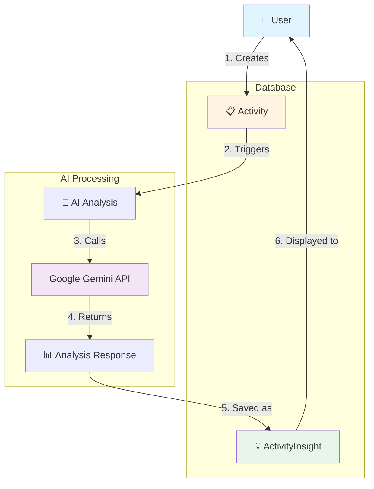

## JSONB Structure

### businessIndicators JSONB

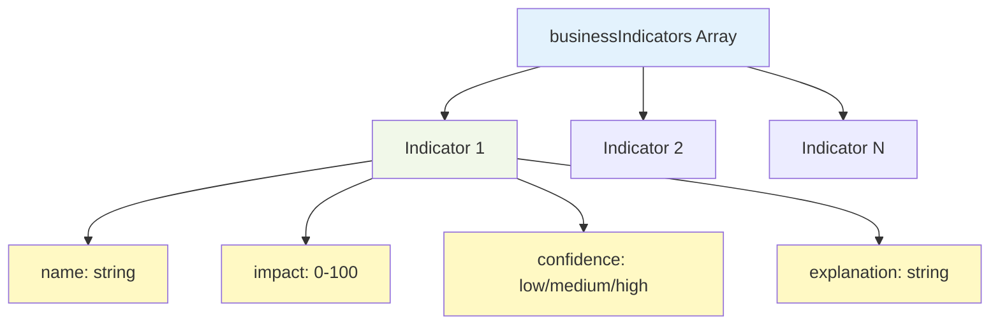

**Example JSON:**
```json
[
  {
    "name": "Tempo de Resposta ao Cliente",
    "impact": 90,
    "confidence": "high",
    "explanation": "Chatbot 24/7 reduz tempo médio de resposta de 4h para <1min"
  },
  {
    "name": "Satisfação do Cliente (CSAT)",
    "impact": 68,
    "confidence": "medium",
    "explanation": "Atendimento instantâneo melhora experiência"
  }
]
```

### maMetrics JSONB

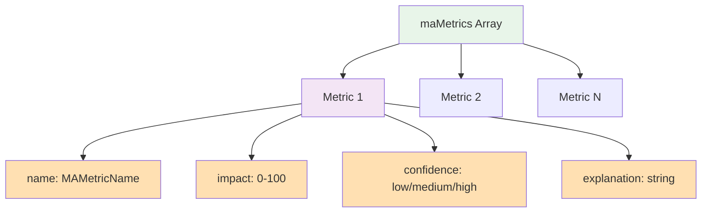

**Example JSON:**
```json
[
  {
    "name": "Customer Churn Rate",
    "impact": 72,
    "confidence": "medium",
    "explanation": "Melhor suporte reduz frustração e churn em 15-25%"
  },
  {
    "name": "NPS Score",
    "impact": 65,
    "confidence": "medium",
    "explanation": "Atendimento 24/7 e respostas rápidas melhoram NPS"
  }
]
```

## Index Strategy

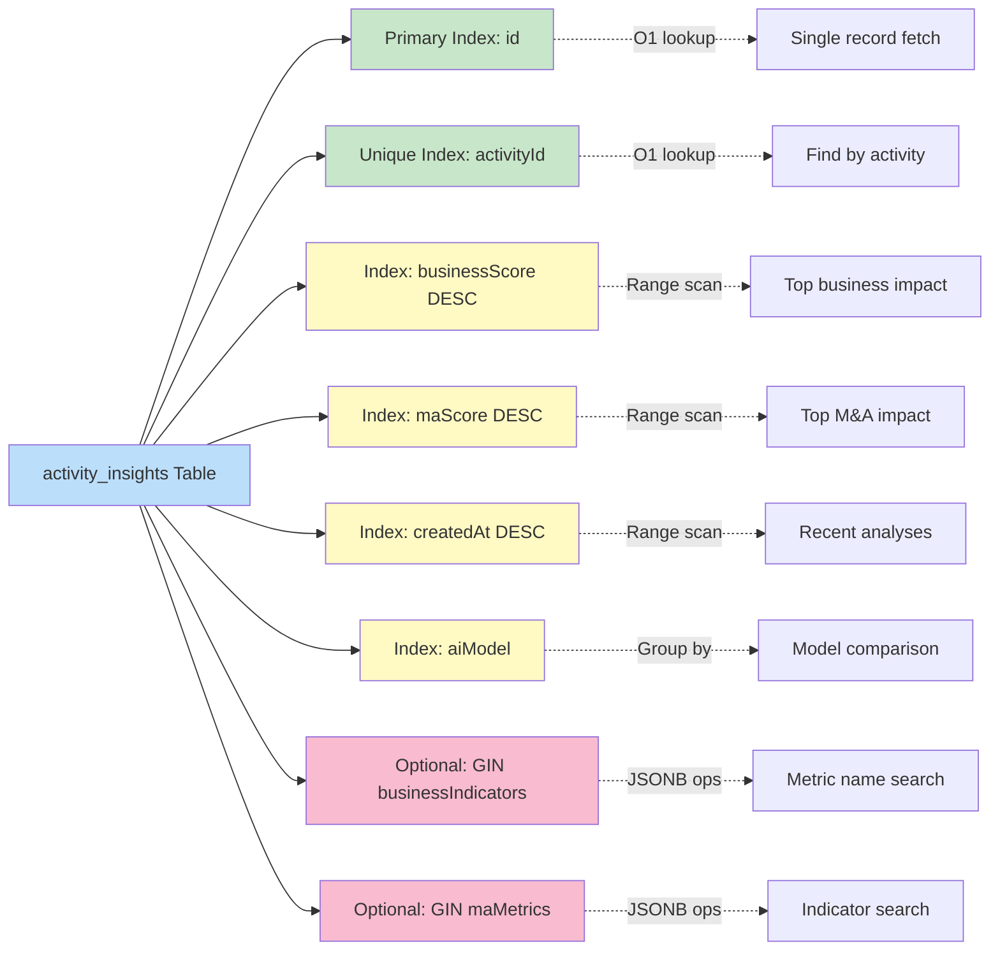

## Query Patterns

### Pattern 1: Get Insight for Activity

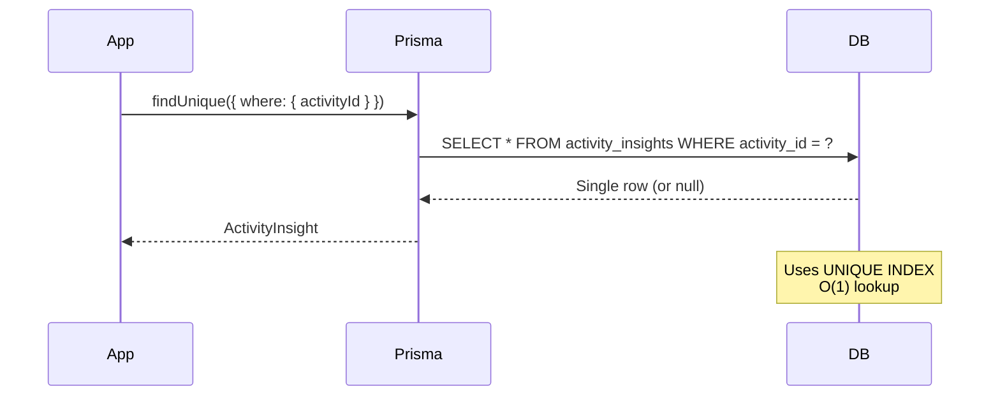

### Pattern 2: Top Activities by M&A Impact

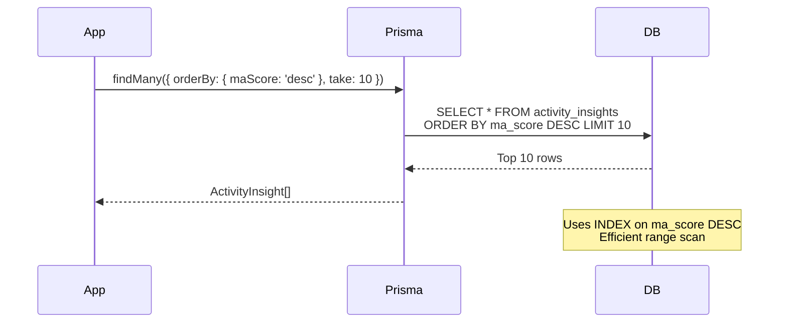

### Pattern 3: Find by Metric Name (JSONB)

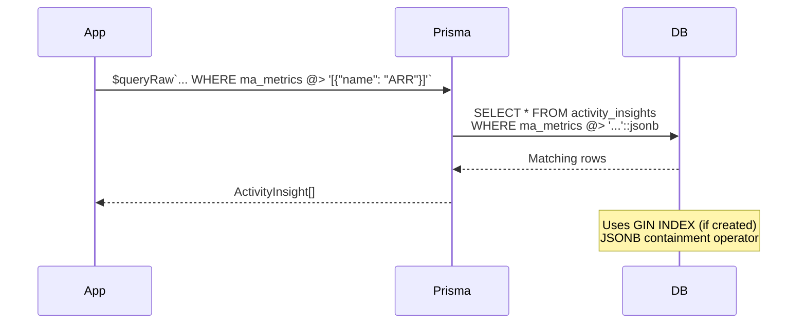

## Score Calculation Flow

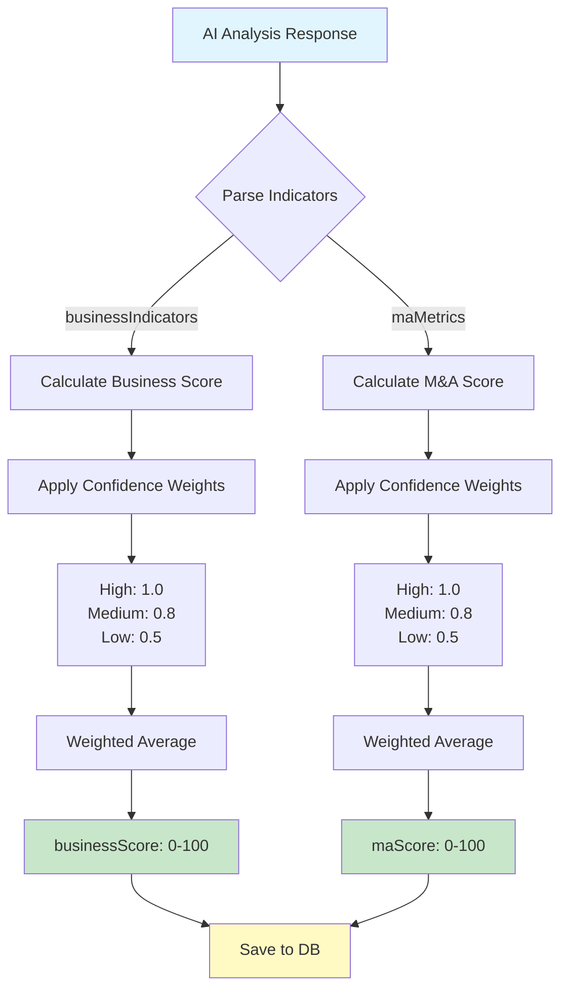

**Formula:**
```
score = round(
  sum(impact_i * weight_i) / sum(weight_i)
)

where:
  weight_high   = 1.0
  weight_medium = 0.8
  weight_low    = 0.5
```

## Performance Characteristics

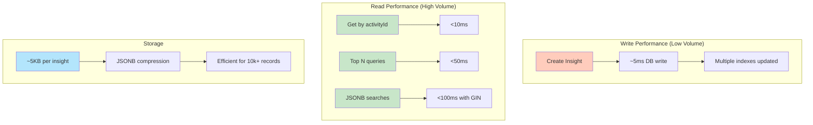

## Data Integrity

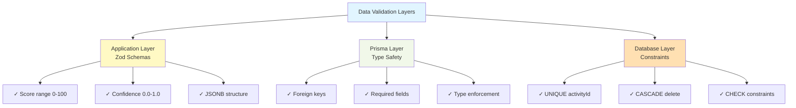

## M&A Metric Categories

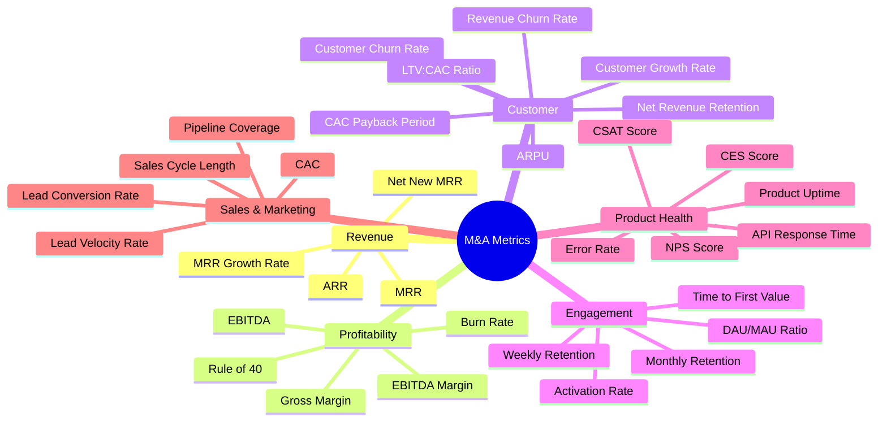

## Use Case: Impact Dashboard

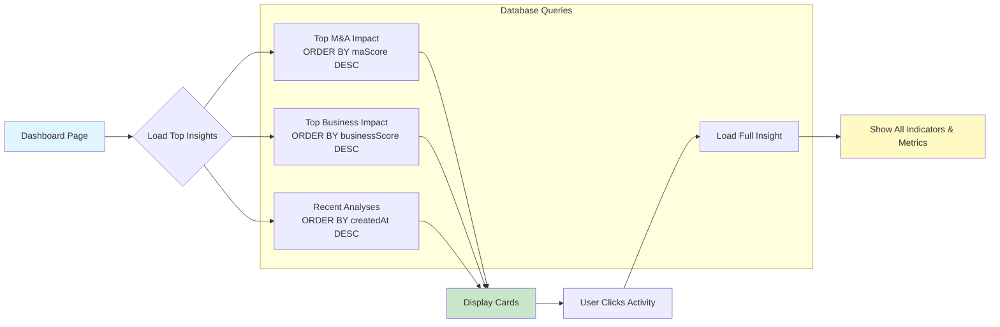

## Migration Timeline

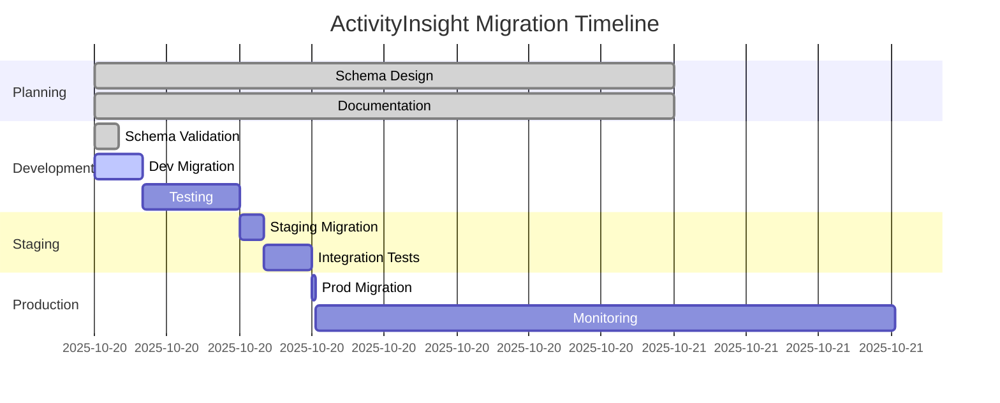

## Security Model

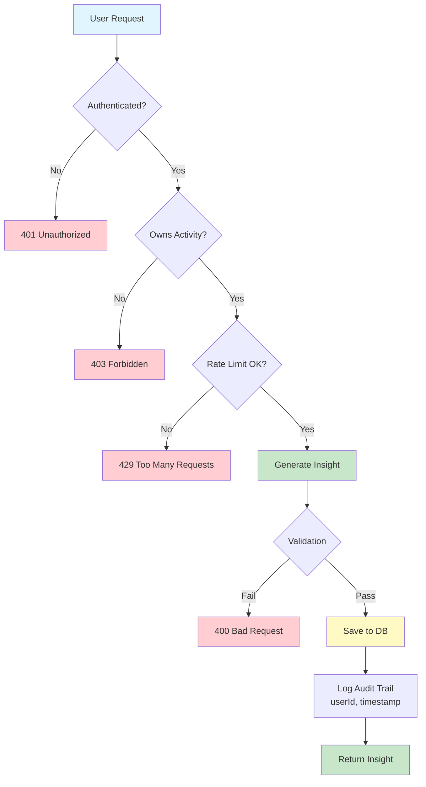

---

**Diagrams Generated**: 2025-10-20
**Tools**: Mermaid.js
**Version**: 1.0
